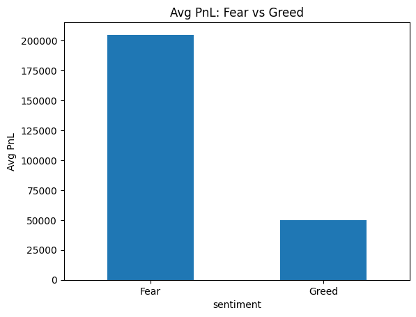
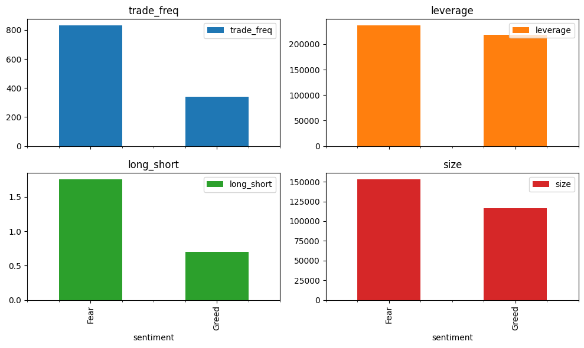
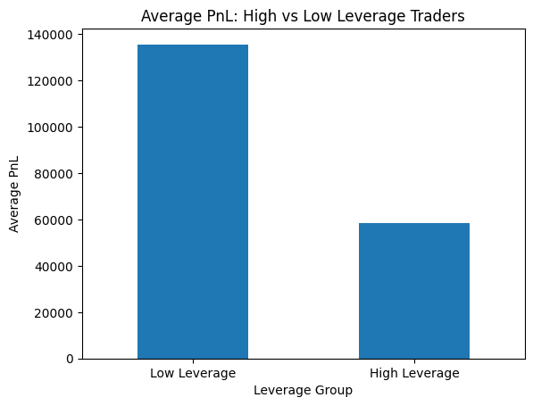
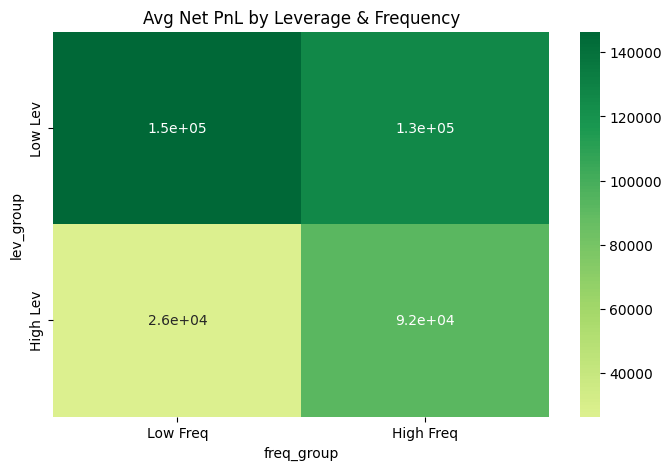

# Trader Behavior & Market Sentiment Analysis

## Project Overview

This project analyzes the relationship between **trader behavior** and **market sentiment (Fear vs Greed Index)** to uncover actionable insights about trading performance, risk-taking patterns, and behavioral shifts under different market conditions.

The analysis combines:
- Historical trading data (orders, PnL, leverage, etc.)
- Market sentiment data (Fear & Greed Index)

---

## Objectives

1. Analyze whether **trading performance** differs between Fear and Greed periods.
2. Understand how **trader behavior changes** with sentiment.
3. Segment traders based on behavior (leverage, activity, consistency).
4. Derive **actionable insights and strategies** from data.

---

## Data Preparation

### Timestamp Conversion
- Converted timestamps to `datetime`
- Extracted `date` for alignment

### Data Alignment
- Aggregated both datasets to **daily level**
- Merged on `date` to combine:
  - Market sentiment
  - Trading activity

---

## Key Metrics Created
  - Daily PnL per trader
  - Win Rate
  - Average Trade Size
  - Profit Factor
  - Leverage Usage
  - Trades per Day
  - Long/Short Ratio

---

## Analysis

### Performance: Fear vs Greed
  - Classified sentiment:
    - If `fear_greed_value` is less than 50, then it indicates Fear
    - If `fear_greed_value` is greater than 50, then it indicates Greed
  - chart: Average PnL Comparison 
    
  - Insight:
    - Traders perform better during Fear periods
    - Greed periods show lower returns

### Drawdown Analysis
  - Drawdown analysis measures the decline from a peak to a subsequent trough in an investment's value.
  - Used minimum daily PnL as drawdown proxy
  - Insight:
    - Fear periods show larger downside risk
    - Indicates unstable market conditions
  - Drawdown Proxy I got:
    `Fear = 204,840.85,
      Greed = –27,466.06`
    
    - Which can means
      - Fear periods: large positive drawdown value, impies larger losses (or deeper drawdowns) during fear period.
      - Greed periods: negative drawdown value, implies smaller drawdowns or even gains during greed period.
    - **BUT** if we combined the insights of <ins>Performance: Fear vs Greed</ins> and <ins>Drawdown Analysis</ins>, we get:
      - During Fear:
        - You make higher profits
        - But also face larger drawdowns (higher risk / volatility)
      - During Greed:
        - You make lower profits
        - But with smaller drawdowns (more stable)

### Behavioral Changes with Sentiment
  - Metrics Analyzed:
    1. Trade frequency
    2. Leverage usage
    3. Long/Short bias
    4. Trade size
  - Chart: Behavior Comparison 
  
  - Insights:
  - We can see the Fear's bar is always at higher than greed's bar.
  - During Fear periods, Traders are:
    - Trading more frequently
    - Taking larger position sizes
    - Likely being more directional (long/short exposure higher)
  - During Greed periods, your Traders are:
    - More passive
    - Taking fewer trades
    - Using smaller capital per trade
  - For Leverage, the difference between the bars is not much, means
    - Traders not increasing leverage much
    - The aggressiveness comes mainly from activity + size, not leverage

### Segment Analysis
  1. **High vs Low Leverage Traders**
  - Chart: Avg PnL: High vs Low Leverage Traders 
   
  - High leverage traders -> lower average PnL
  - Low leverage traders -> higher average PnL
  - Which can concluded as, increasing leverage is hurting performance on average, not improving it.
  2. **High and Low Frequency traders vs High and low Leverage Traders**
  - chart: Avg Pnl by Leverage and Frequency 
      

|                  | Low Frequency | High Frequency |
|------------------|--------------|---------------|
| Low Leverage     | 150k         | 130k          |
| High Leverage    | 26k          | 92k           |

  - Insights:
    - Low leverage dominates in both cases, it implies that Leverage is hurting performance more than helping
    - High leverage only “works” when activity is high, also increasing frequency partially compensates and
    - Low frequency is powerful—but only with low leverage
      - Low freq + Low lev → best outcome (150k)
      - Low freq + High lev → worst outcome (26k)

---

## Key Findings

### 1. Sentiment Strongly Influences Performance
  - Fear → Higher average returns
  - Greed → Higher losses or low returns and volatility
### 2. Risk Behavior is Sentiment-Driven
  - Trading activity and position sizing increase during Fear, indicating higher risk exposure
  - While Greed periods show more conservative activity patterns
### 3. High Leverage Increases Risk, Not Reliability
  - High leverage -> lower average PnL
  - High leverage behaves worse across segments (especially low frequency)
### 4. Consistency Beats Aggression
  - Low leverage + low frequency = best performance (150k)
  - Stable traders outperform high-frequency or high-risk traders
  - Risk control is a key success factor

---

## Strategy Recommendations
1. Prioritize low leverage 
During all market conditions:
    - Maintain low leverage as default
    - Avoid aggressive scaling of exposure
    - Use leverage only in high-confidence setups

3. Selective Trading Over High Frequency 
Across all regimes:
    - Focus on trade quality rather than trade quantity
    - Avoid overtrading in low-edge conditions

4. Fear Regime Opportunity Management 
During Fear periods:
    - Increase selectivity, not risk
    - Keep position sizing controlled
    - Avoid compounding leverage with volatility

5. Greed Regime Capital Preservation 
During Greed periods:
    - Reduce unnecessary trading activity
    - Prioritize consistency over expansion
    - Maintain disciplined risk exposure

---

## Conclusion
- Trading performance is not purely skill-based, but also market-condition dependent
- Trader behavior dynamically changes with sentiment
- Risk management strategies should be adaptive, not static

## Set up and how to run
1. Click this: [Kaggle NoteBook](https://www.kaggle.com/code/dozeradi007/p-trade-asgn-0)
2. After clicking you get to see a saved version of my .ipynb file.
3. In top right you'll see a button **Copy & Edit**, click that button, new notebook will open.
4. Start the session and click on Run all
